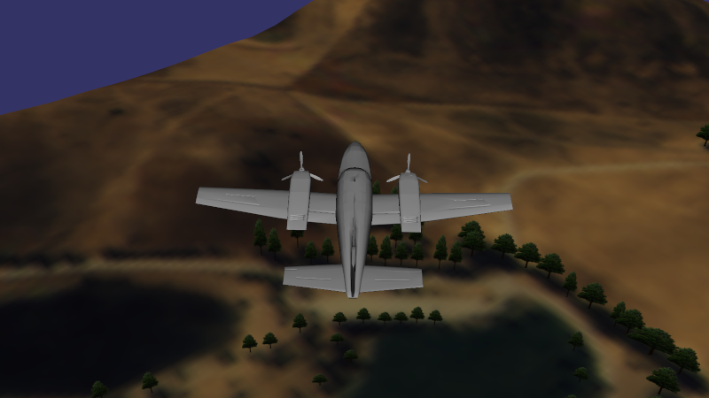
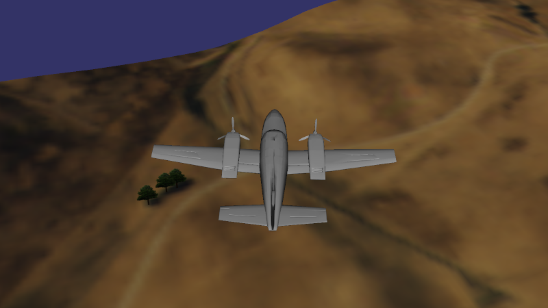
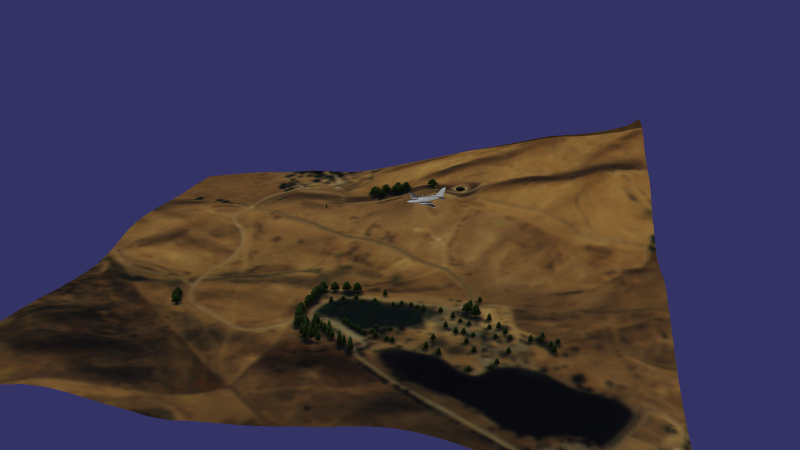

# osgCookbook4.7
Exercício 4.7 "Using manipulators to follow models"

Para compilar:

`g++ cook4.7.cpp -losg -losgDB -losgGA -losgViewer -o cook4.7`

Use as teclas 1 e 2 para alternar entre as diferentes câmeras.

Atualmente, os movimentos de uma câmera ainda interferem de maneira caótica na outra câmera.
