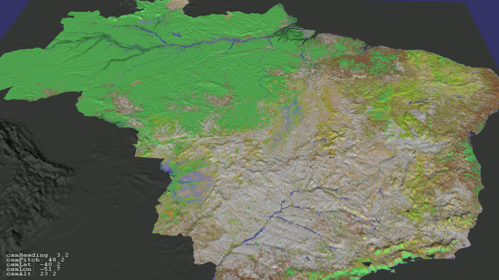

# terreno1

Primeiro terreno controlado por mouse e teclado.

A tela pode variar entre tela-cheia e janela, comentando ou não `viewer.setUpViewInWindow`.

## Feito

### Usar as teclas não para mover diretamente, mas para acelerar e frear os motores do "OVNI".

As teclas são captadas em `OVNIController::handle`, alterando as variáveis booleanas keyW, keyA, keyS... até keyF:
- keyW: pra frente
- keyS: pra trás
- keyA: pra esquerda
- keyD: pra direita
- keyR: pra cima
- keyF: pra baixo

Esse movimento é relativo ao ângulo apontado pela câmera. Assim, se a câmera olha pro chão, "pra cima" é um movimento paralelo ao chão (para a frente).

A função `calcAcc` calcula a aceleração, usando as variáveis velX, velY e velZ, que são alteradas de acordo com as teclas pressionadas. Caso nenhuma das duas teclas de uma certa direção esteja apertada, o movimento naquela direção é freado 90% a cada frame (ex: `velZ *= 0.9f;`).

### Acrescentar HUD (heads-up display)

HUD com texto simples, no canto inferior esquerdo, indicando o ângulo da câmera (Heading e Pitch) e sua posição (Lat, Lon e Alt). Detalhe: o mapa já vem georreferenciado do GDAL, por isso Lat e Lon são obtidas diretamente do `osg::Vec3d eyePos`. Alt está na mesma escala (graus), e será depois corrigido para quilômetros.

## Prioridade 1

### Não trancar o mouse nas bordas da janela.

Tentativa:

- `centerMousePointer( ea, aa );`
- `if (_ga_t0->getX() == windowW/2 && _ga_t0->getY() == windowH/2) return false;`

Problema: Perda significativa de desempenho. Dizem que há uma maneira de jogar o cursor do mouse para o centro da janela a cada frame, sem chamar as funções `handle` e `performMovement`, mas ainda não encontrei.

### Esconder o cursor.

Solução:

- `window->useCursor(false);`
- `window->setCursor(osgViewer::GraphicsWindow::NoCursor);`

Dúvida: não sei qual a diferença entre essas duas linhas. Aparentemente fazem a mesma coisa. Serão aplicadas quando for resolvida a pendência anterior (não trancar o mouse nas bordas da janela).

### Colocar a câmera inicial no alto, centralizada sobre o país, de forma que o mesmo caiba inteiro na tela (com o norte ou o sul pra cima, dependendo da configuração).

## Prioridade 2

- Acrescentar ao HUD as coordenadas do ponto onde o mouse (ou o + no centro da tela) aponta
- Usar teclas PageUp para ganhar altitude, e PageDown para perder altitude
- Usar teclas Shift para acelerar
- Usar tecla Tab (alguma outra?) para alternar mouse entre navegação (MODO A: girar câmera, cursor invisível) e movimento do cursor (MODO B: câmera parada, cursor visível)
- MODO B: identificar elementos da geografia, com nomes no HUD
- Usar teclas QE para girar ao redor do eixo vertical (do mundo, não da câmera -- pois não há roll). Embora os movimentos horizontais do mouse já façam isso, pode fazer mais rápido, e também pode ser útil no MODO B)
- Mudar a posição do Sol segundo horário e estação do ano
- Inserir shapefiles
