# terreno1

Primeiro terreno controlado por mouse e teclado.

A tela pode variar entre tela-cheia e janela, comentando ou não `viewer.setUpViewInWindow`.

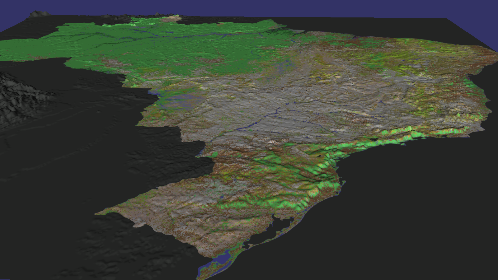

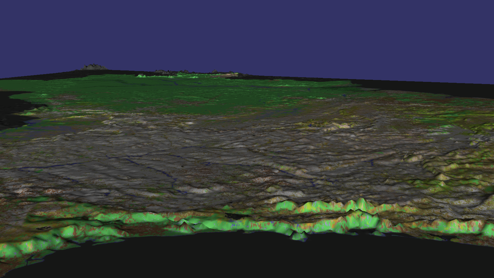

## Feito

### Usar as teclas não para mover diretamente, mas para acelerar e frear os motores do "OVNI".

As teclas são captadas em `OVNIController::handle`, alterando as variáveis booleanas keyW, keyA, keyS... até keyF:
- keyW: pra frente
- keyS: pra trás
- keyA: pra esquerda
- keyD: pra direita
- keyR: pra cima
- keyF: pra baixo

Esse movimento é relativo ao ângulo apontado pela câmera. Assim, se a câmera olha pro chão, "pra cima" é um movimento paralelo ao chão (para a frente).

A função `calcAcc` calcula a aceleração, usando as variáveis velX, velY e velZ, que são alteradas de acordo com as teclas pressionadas. Caso nenhuma das duas teclas de uma certa direção esteja apertada, o movimento naquela direção é freado 90% a cada frame (ex: `velZ *= 0.9f;`).

### Acrescentar HUD (heads-up display)

HUD com texto simples, no canto superior esquerdo, indicando a posição da câmera (lat:lon:alt) e seu ângulo (H/P = Heading/Pitch -- Heading será usado na bússola). Detalhe: o mapa já vem georreferenciado do GDAL, por isso Lat e Lon são obtidas diretamente do `osg::Vec3d eyePos`. Alt está na mesma escala (graus, porém modificado pelo parâmetro -v do vpbmaster), e será depois corrigido para metros. O HUD também apresenta um cursor central amarelo, enquanto o mouse está preso à câmera. O mouse pode ser liberado/preso novamente com a tecla Tab, mostrando/escondendo o cursor.

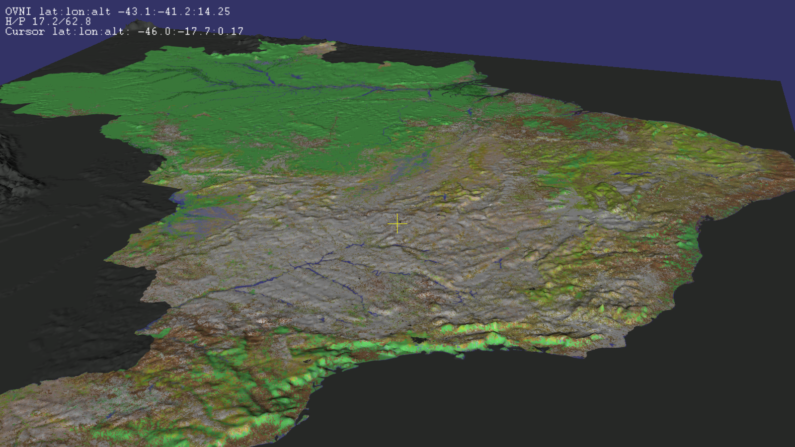

### Não trancar o mouse nas bordas da janela.

Em `OVNIController::handleMouseMove`, verifico se o cursor do mouse se aproximou da beira da janela (10% da largura ou altura). Neste caso, o desloco (`aa.requestWarpPointer`) para a beira oposta, mas numa distância maior (20%), impedindo que o processo aconteça repetidas vezes caso o mouse se mova paralelo à beira bem na faixa dos 10%.

A função `requestWarpPointer` chama automaticamente a função `performMovement`, o que não consegui evitar. Mas com uma combinação das variáveis booleanas globais `mouseFree` e `Warping`, consegui resolver o problema de desempenho observado anteriormente.

### Esconder o cursor.

Usei `window->useCursor(false);` e ignorei `window->setCursor(osgViewer::GraphicsWindow::NoCursor);` (ainda não sei a diferença).

### Colocar a câmera inicial no alto, centralizada sobre o país, de forma que o mesmo caiba inteiro na tela (com o norte ou o sul pra cima, dependendo da configuração).

Feito com apenas duas linhas. Por enquanto apenas Norte para cima.

```
osg::Quat quad0;
controller->setTransformation(osg::Vec3(-54.4f,-14.2666667f,80.0f), quad0 ); // camLon (-74-34.8)/2 = -54.4, camLat (5.3333333-33.8666667)/2 = -14.2666667, camAlt = 80
```

As coordenadas de cálculo são os limites do mapa do Brasil.

### Acrescentar ao HUD as coordenadas do ponto onde o mouse (ou o + no centro da tela) aponta

Feito com a função `pick` encontrada em <osg>/examples/osgpick/osgpick.cpp, linha 102.

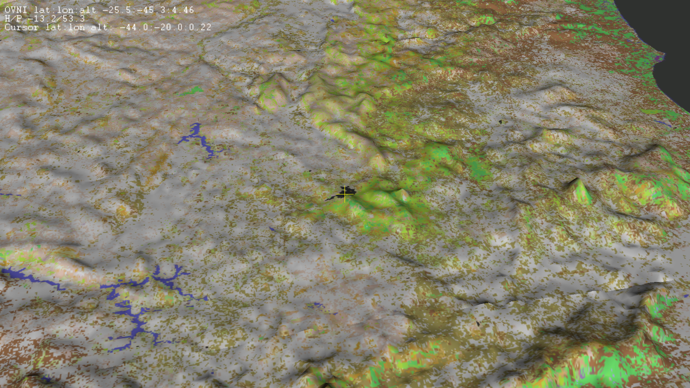

### Usar tecla Tab (alguma outra?) para alternar mouse entre navegação (MODO A: girar câmera, cursor invisível) e movimento do cursor (MODO B: câmera parada, cursor visível)

Alterna entre a exibição do cursor do mouse e o cursor em cruz amarela no centro da tela (`OVNIController::handle, ea.getKey() == 65289`). Também mostra um menu translúcido (ainda sem botões) quando o cursor do mouse está visível.

### Altitude mínima paralela ao terreno (usar ray-cast -- pick -- vertical)

Feito com a função `pickDown`, a partir de um exemplo em `src/osgUtil/LineSegmentIntersector.cpp`. Agora a câmera pode "caminhar" sobre o terreno, acompanhando o relevo.

### Desenhar bússola (a partir do Heading) (removível)

A bússola (canto inferior direito) acompanha o ângulo da câmera. Diferentes imagens podem ser escolhidas. Pode ser escondida/mostrada com a tecla 'b'.

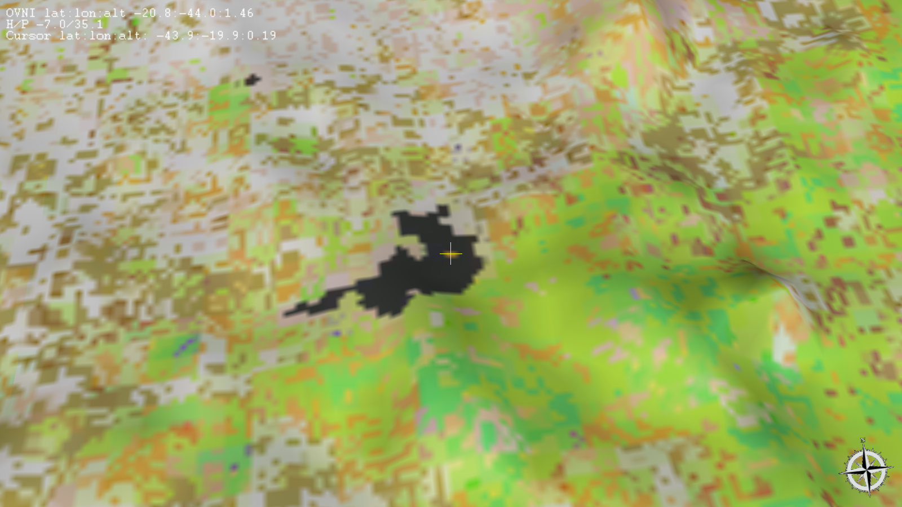

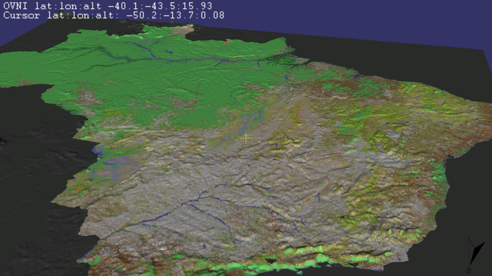

## Tentativa

### Inserir shapefiles

Ler as coordenadas de um arquivo de shapefile (ESRI) não ocupa muito código (~ 200 linhas). Um shapefile bastante detalhado dos estados brasileiros tem 19.481 pontos (em 314 kB), e pode ser visto nas imagens abaixo, disposto a uma distância "segura" do solo.

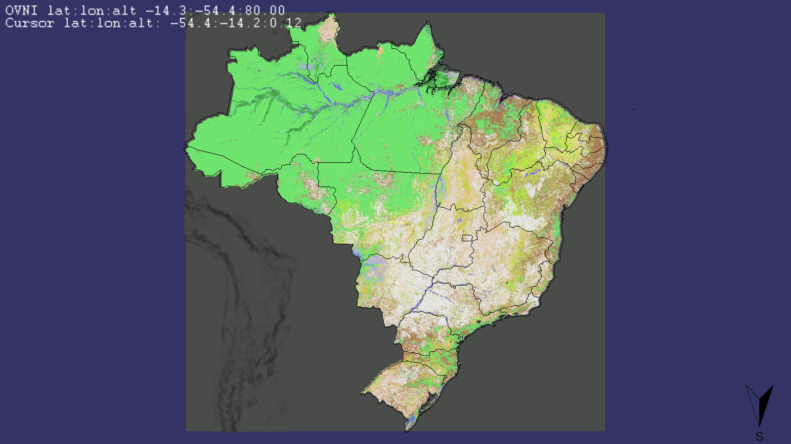

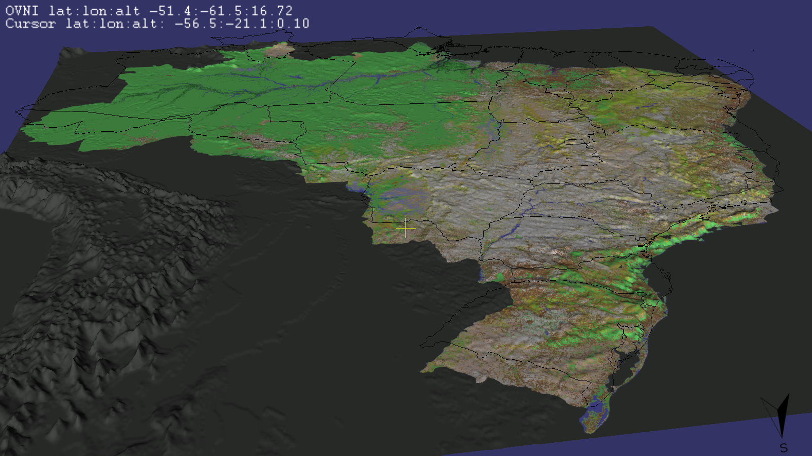

Calcular a altitude de cada ponto para desenhá-los junto ao chão leva cerca de 2 segundos, numa máquina relativamente possante. Para o objetivo desse projeto (rodar em máquinas fracas) o tempo será consideravelmente maior. E ainda não é uma solução eficaz, pois o relevo pode mudar entre dois pontos vizinhos, deixando parte da linha "soterrada", como na figura abaixo.

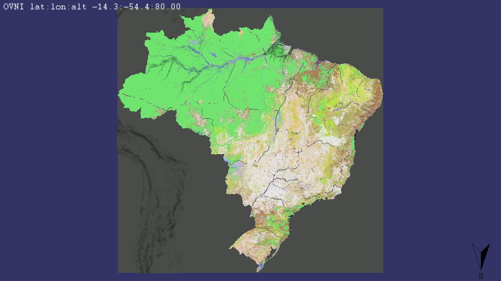

Pelas razões expostas, shapefiles podem até ser úteis de outra forma, mas não para mostrar as UFs do país. Para isso, algo que modifique a textura (como uma sombra, um decalque, uma projeção) deverá funcionar melhor. A imagem para isso poderá ser gerada do mesmo shapefile, até mesmo (talvez) em tempo real (caso contrário, pode ser gerada na inicialização do jogo ou vir com o pacote de instalação).

### Mudar a posição do Sol segundo horário e estação do ano

As teclas L e O giram o Sol para Leste e Oeste. K e I giram para Sul e Norte. Não consegui fazer com que a mudança da direção da *luz direcional* funcionasse, por isso estou usando *luz pontual*. Ângulos muito baixos destacam ainda mais a "costura" entre as *tiles* do terreno, o que é péssimo.

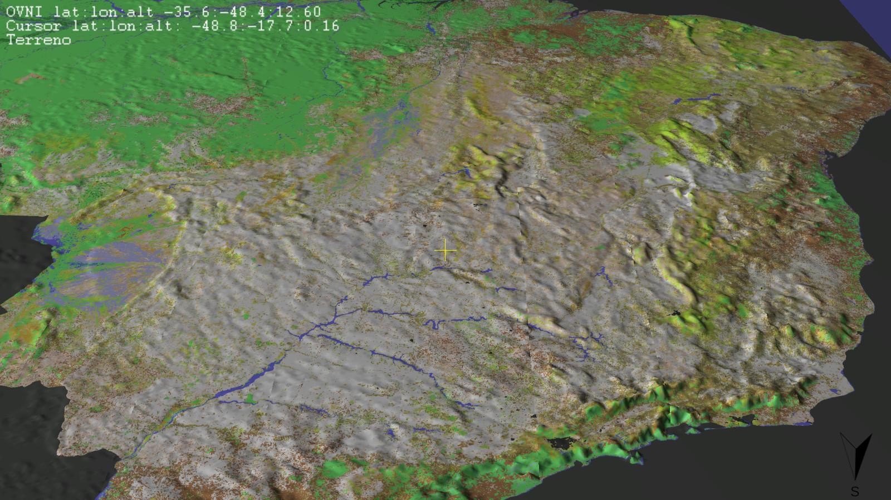

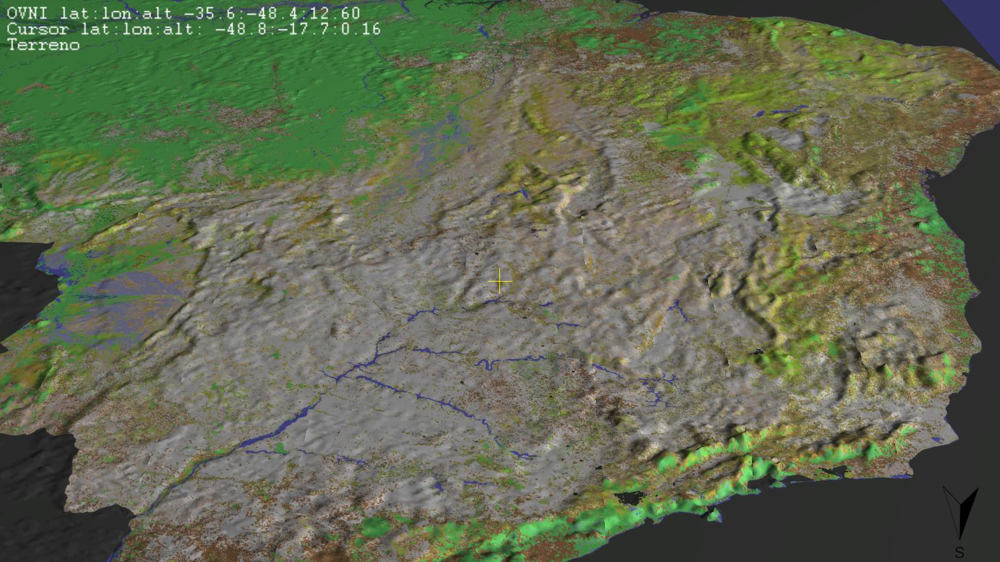

### Inserir blocos e identificá-los com o mouse

A barra de espaço é usada para inserir cubos vermelhos, cujo movimento inicial é na direção em que a câmera aponta. A partir daí cada cubo cai simulando um movimento de queda livre, parando no solo. O cursor central pode ser usado para identificar os cubos. Apertando tab para liberar o mouse, o cursor móvel também pode ser usado para identificá-los.

Um cubo sendo lançado do alto. Repare seu tamanho maior que os outros dois, à esquerda, indicando que ainda não chegou ao chão.

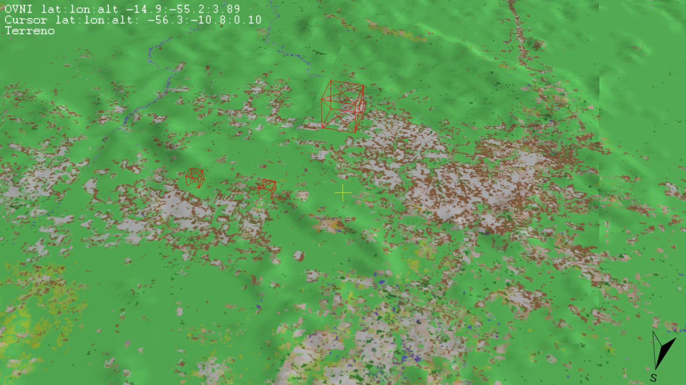

Um dos cubos sendo identificado com o mouse, destacado em branco. Seu nome aparece no painel, no alto da tela.

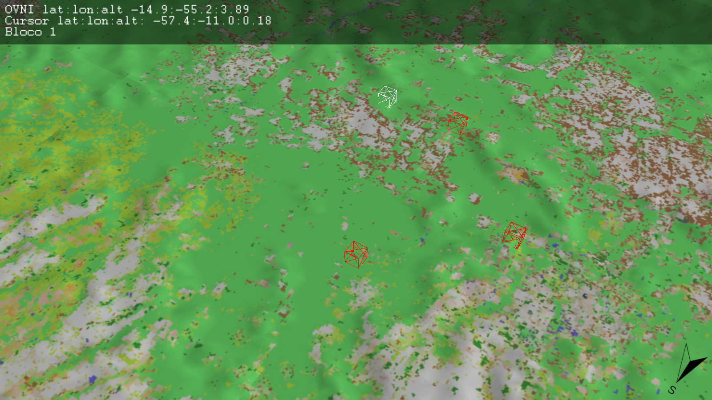

Para mover um cubo, mude para o modo de mouse livre (Tab), clique nele com o botão esquerdo do mouse e arraste. O cubo ficará amarelo enquanto estiver sendo arrastado.

A ideia é dominar essas técnicas para acrescentar e manipular tipos variados de objetos sobre o terreno. O próximo passo é dar nome a cada cubo usando algum Widget.

## Prioridade 1

- Identificar elementos da geografia, com nomes no HUD
- Compilar estaticamente para testar em outras máquinas, onde o OSG não esteja instalado.
- Acrescentar elementos ao HUD (imagens, menus, botões, inputs, etc)
- Modificar a textura do mapa dinamicamente
- Mudar de país dinamicamente, criando mapa do vpbmaster de dentro do programa e calculando corretamente altitude, etc.

## Prioridade 2

- Usar teclas PageUp para ganhar altitude, e PageDown para perder altitude
- Usar teclas Shift para acelerar
- Usar botão direito do mouse (?) para navegar na mesma altitude
- Usar teclas QE para girar ao redor do eixo vertical (do mundo, não da câmera -- pois não há roll). Embora os movimentos horizontais do mouse já façam isso, pode fazer mais rápido, e também pode ser útil no MODO B
- Usar outras fontes no HUD
